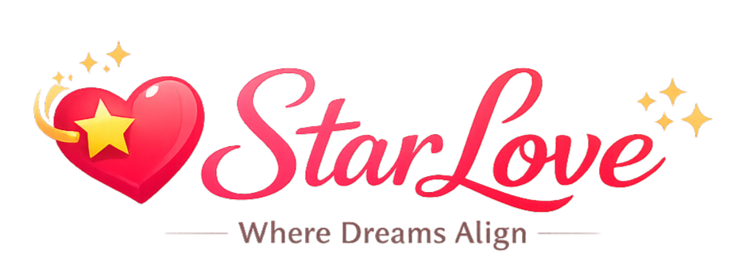
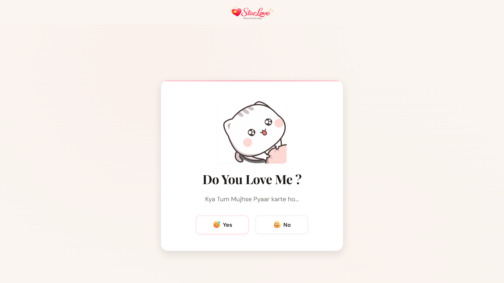
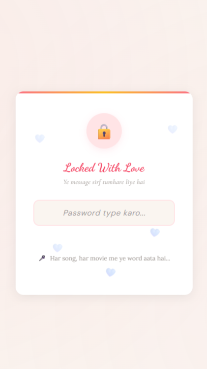

<div align="center">


<br><br>

<!-- Typing animation -->
<a href="https://git.io/typing-svg">
  
  
</a>

### A Cinematic Interactive Love Experience by Starverse

<p align="center">
  <strong>
    Modern romantic web experience featuring emotional interactions, floating hearts,
    cinematic transitions, confetti celebrations, and an impossible-to-click "No" button.
  </strong>
</p>

<!-- CTA Button -->
### 🚀 [✨ Experience The Live Demo ✨](https://www.starlove.free.nf/)

<br/>

<!-- Preview Image -->
<a href="https://starverse1130.github.io/Star-Love/">
  
</a>

<br/>


<p align="center">
  <a href="#-features">Features</a> •
  <a href="#-quick-start">Quick Start</a> •
  <a href="#-screenshots">Screenshots</a> •
  <a href="https://starverse1130.github.io/Star-Love/">Live Demo</a>
</p>


<!-- Divider wave -->


> ### *"Rejecting was never supposed to be this difficult."* 💌


</div>

<br/>

## 📖 Table of Contents

- [✨ About The Project](#-about-the-project)
- [🎬 Features](#-features)
- [🖥️ Screenshots](#️-screenshots)
- [🛠️ Tech Stack](#️-tech-stack)
- [⚡ Quick Start](#-quick-start)
- [📁 Project Structure](#-project-structure)
- [♿ Accessibility](#-accessibility)
- [🤝 Contributing](#-contributing)
- [📜 License](#-license)

<br/>

---

## ✨ About The Project


**Do You Love Me?** is a whimsical, emotionally-charged interactive web experience where the interface itself becomes the storyteller.

From floating hearts 💗 and confetti explosions 🎊 to a mischievous **"No" button** that literally runs away from the cursor — every micro-interaction is crafted to make rejection feel impossible and love feel inevitable.

Built entirely with **vanilla HTML, CSS & JavaScript** — no frameworks, no dependencies, just pure front-end magic.

<br/>

---

## 🎬 Features

<table>
<tr>
<td width="50%">

### 💫 Visual Magic
- 🎊 **Confetti explosions** on "Yes"
- 💖 **Floating hearts** ambient layer
- ✨ **Cinematic scene transitions** with blur + fade
- 🌈 **Gradient animated backgrounds**

</td>
<td width="50%">

### 🕹️ Interactive Chaos
- 🏃 **Escaping "No" button** — it literally runs away
- 🐱 **Animated GIF reactions** per answer
- 🎭 **Multi-stage emotional storyline**
- 📱 **Fully responsive** on all screen sizes

</td>
</tr>
<tr>
<td width="50%">

### ⚡ Performance
- 🧹 **Zero dependencies** — pure vanilla stack
- 🚀 **Instant load** — no build step required
- 🎨 **CSS-only animations** — GPU accelerated
- 🗜️ **Lightweight** — < 50KB total

</td>
<td width="50%">

### ♿ Accessibility
- 🌐 **WCAG 2.2 compliant**
- ⌨️ **Full keyboard navigation**
- 👁️ **Screen reader friendly**
- 🎯 **Focus-visible indicators**

</td>
</tr>
</table>

<br/>

---

## 🖥️ Screenshots

<div align="center">

| 💻 Desktop | 📱 Mobile |
|:---:|:---:|
|  |  |

</div>

<br/>

---

## 🛠️ Tech Stack

<div align="center">

| Technology | Purpose |
|:---:|:---|
|  | Semantic and accessible structure |
|  | Cinematic UI, animations & responsive styling |
|  | Interactive logic and dynamic user experience |
|  | Fast and seamless project hosting |

</div>

<br/>

---

## ⚡ Quick Start

No installation needed. Just clone and open!

```bash
# Clone the repository
git clone https://github.com/Starverse1130/Star-Love.git

# Navigate into the project
cd Star-Love

# Open directly in browser
open index.html
# or just double-click index.html in your file explorer!
```

> 💡 **Tip:** Works on any modern browser. No server, no npm, no build step required.

<br/>

---

## 📁 Project Structure

```
StarLove/
│
├── 📄 index.html              # Main entry point
├── 📄 site.webmanifest        # PWA manifest
├── 📄 sw.js                   # Service worker (PWA)
├── 📄 LICENSE                 # MIT License
└── 📖 README.md
│
├── 🎨 assets/
│   ├── icons/
│   │   ├── StarTag.png        # Project logo
│   │   ├── StarLogo.png       # Secondary logo
│   │   ├── favicon.ico        # Favicon
│   │   ├── favicon-16x16.png  # 16px favicon
│   │   ├── favicon-32x32.png  # 32px favicon
│   │   ├── android-chrome-192x192.png  # PWA icon (192px)
│   │   ├── android-chrome-512x512.png  # PWA icon (512px)
│   │   └── apple-touch-icon.png        # Apple touch icon
│   └── screenshots/
│       ├── desktop-index.png  # Desktop preview
│       └── mobile-index.png   # Mobile preview
│
├── 🎨 css/
│   ├── style.css              # Main styles + cinematic UI
│   ├── animations.css         # Animation definitions
│   ├── responsive.css         # Responsive breakpoints
│   └── accessibility.css      # Accessibility enhancements
│
├── ⚙️ js/
│   ├── main.js                # Core interaction logic
│   └── dodge.js               # "No" button dodge mechanics
│
├── 📄 pages/
│   ├── yes.html               # "Yes" response page
│   ├── no1.html               # "No" response — variant 1
│   ├── no2.html               # "No" response — variant 2
│   ├── no3.html               # "No" response — variant 3
│   └── answer_file.html       # Answer response handler
```

<br/>

---

## ♿ Accessibility

This project follows **WCAG 2.2** guidelines to ensure an inclusive experience:

- ✅ Semantic HTML5 elements with proper ARIA labels
- ✅ Keyboard-navigable interface (Tab / Enter / Space)
- ✅ Focus-visible outlines on all interactive elements
- ✅ Sufficient color contrast ratios (≥ 4.5:1)
- ✅ Screen reader announcements for dynamic content
- ✅ Reduced motion support via `prefers-reduced-motion`

<br/>

---

## 🤝 Contributing

Contributions are always welcome! Got a cute new animation or a sneakier "No" button escape route? 👀

```bash
# Fork → Clone → Branch → Code → PR
git checkout -b feature/sneakier-no-button
git commit -m "feat: no button now teleports to another dimension"
git push origin feature/sneakier-no-button
```

1. 🍴 **Fork** the repository
2. 🌿 **Create** your feature branch
3. ✅ **Commit** your changes
4. 📬 **Open** a Pull Request

<br/>

---

## 📜 License

This project is licensed under the **MIT License** — allowing you to freely use, modify, distribute, and build upon the project for personal or commercial purposes.

See the [`LICENSE`](LICENSE) file for complete details.

> Built with love, shared with freedom.  
> Just spread positivity, not rejection. 💖

<br/>

---

<div align="center">


### Ayush Gupta • AI & Creative Developer

Built with ❤️ and AI-Driven Engineering by **Ayush Gupta** [[Starverse]](https://github.com/starverse1130) for a faster web.
</div>

---

